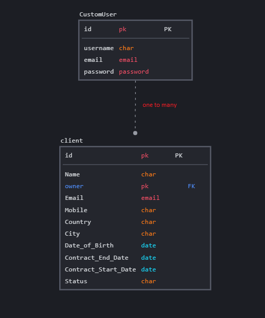

# Challenge test: contract_users

## Auther : Walaa atiyh

## databass : elephantsql[postgresql]

 

## Run the code

1. **Clone the repo**
2. **create  file `project/.env`
3. **add every thing in  `project/.env.sample` in `.env` file**
4. **Create the VE and activate it.**
   * `python3.10 -m venv .venv `
   * `source .venv/bin/activate`

5. **install requirements.txt**

    * `pip3 install -r requirements.txt`

6. **work with docker**
   * `docker-compose up --build`
   *  if you create anew app (module) run this command in another template
   * `docker-compose run web python manage.py makemigrations`
   *  `docker-compose run web python manage.py migrate`

8. **run in local**
   * `python manage.py runserver`

9.  **superuser**

    username :admin
    
    password:admin

## Getting Started

## 1.  Authentication and Permission for models
 

| API end-points             | HTTP Method   | Authentication      | Permission    | Result                                       |
|----------------------      |-------------  |------------         |------------   |------------------------------------------     |
| /api/v1/client/list        | GET           | User                | User          | List of clients                           |
| /api/v1/client/list        | POST          | User                | User          | Create new clients                           |
| /api/v1/client/{client_pk} | GET           | User                | User          | Retrieve details of a particular client  |
| /api/v1/client/{client_pk} | PUT           | User-owner          | User-owner    | Update a particular client's info   |
| /api/v1/client/{client_pk} | DELETE        | User-owner          | User-owner    | DELETE a particular client  |

# api-quick-start

Template Project for starting up CRUD API with Django Rest Framework
